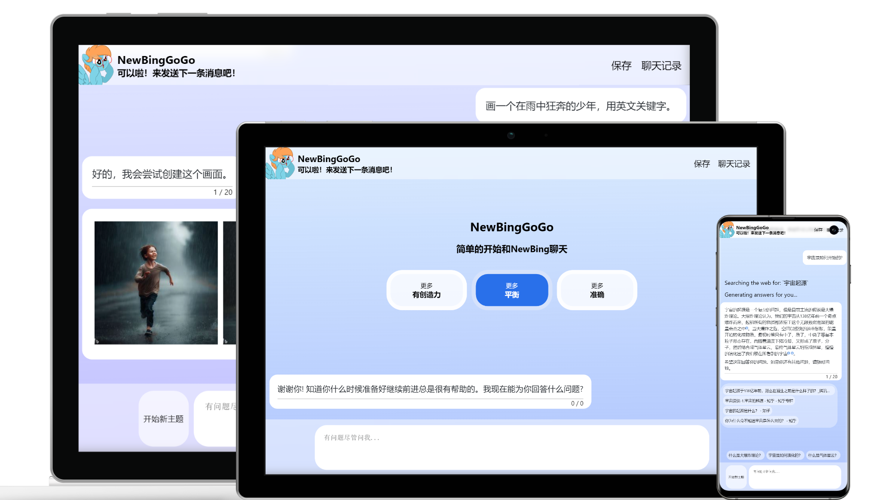

# NewBingGoGo-web

一个基于微软OpenAI ChatGPT GPT4的New Bing接口的Web服务。
提供了好看的对话页面。
实现了微软New Bing的大多数功能，还添加了一些自己的特色功能。
开源免费。

演示站点：
- java https://chat.jja8.cn/
- cloudflareWorker.js https://bingweb.jja8.cn/

## 功能介绍
此服务可直接通过网页访问也可以作为NewBingGoGo插件的魔法链接服务使用。

#### **直接访问** 
直接访问需要在配置文件中设置共享账号，可以设置多个共享账号随机访问。

#### **作为魔法链接**
作为魔法链接使用时，不会使用配置文件中的共享账号。用户需要登录自己的微软账号。

## 部署方法

[快速入门 wiki](https://github.com/jianjianai/NewBingGoGo-Web/wiki/%E5%BF%AB%E9%80%9F%E5%85%A5%E9%97%A8)

## 更加强大的插件版
web版才发布不久，后续会逐渐完善功能。插件版有的功能web版也会逐步添加完善。目前如果想要更好的体验欢迎前往插件版。

[NewBingGoGo : 简单开始和NewBing聊天 gitee](https://gitee.com/jja8/NewBingGoGo)

| 功能     | 插件版 | web版 | 描述                                     |
|--------|-----|------|----------------------------------------|
| 聊天     | ✔   | ✔    | 和New Bing对话，提出问题。                      |
| 生成图片   | ✔   | ✔    | 在有更创造力选项中让New Bing生成图片                 |
| 提示词    | ✔   | ✔    | 使用提示词使AI更好地理解需求                        |
| 免登录    | ❌   | ✔    | 无需登录，直接使用。                             |
| 创作     | ✔   | ✔    | 使用New Bing生成文章，Edge浏览器New Bing侧边栏的撰写功能 |
| 小窗     | ✔   | ❌    | 在页面中打开小窗，可根据当前页面内容对话。Edge浏览器侧边栏的聊天功能   |
| 聊天记录   | ✔   | ✔    | 保存聊天记录，可查看或继续聊天                        |
| 登录微软账号 | ✔   | ❌    | 登录微软账号，使用自己的账号访问New Bing               |
| 内容卡片   | ✔   | ✔    | 显示天气，查找图片，地图等等。                        |
| 通过机器人验证| ✔ | ✔  | 当请求频繁时，微软要求通过机器人验证，就是输入验证码|

