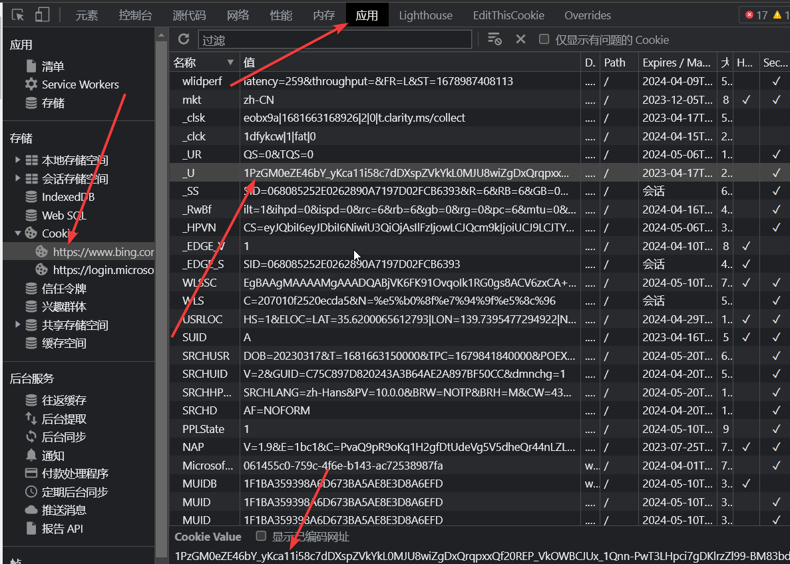

# NewBingGoGo-web

NewBingGoGo的web精简版。可用设置多个bing账号轮询。部署后可直接通过网页访问。
适用于自己搭建一个NewBing服务分享给他人使用。也可以作为魔法链接服务使用。

演示站点：
- java https://newbinggogo-web.zeabur.app/
- cloudflareWorker.js http://bingweb.xn--xyza.top/

提供了好看的对话页面。
实现了NewBing的大多数功能，还添加了一些自己的特色功能。
开源免费，国内可用！

完整版本：https://gitee.com/jja8/NewBingGoGo


## 安装和运行
### docker

这个仓库里有例子Dockerfile，可以按照需求修改后直接使用。记得设置Cookies.yml配置文件哦。

https://github.com/jianjianai/NewBingGoGo-Web-docker

### ubuntu
#### 从源代码编译运行
准备好jdk17环境
~~~
sudo apt install openjdk-17-jdk
~~~

安装git
~~~
sudo apt install git
~~~

克隆源代码
~~~
git clone https://github.com/jianjianai/NewBingGoGo-Web
cd NewBingGoGo-Web
~~~

编译并生成jar包
~~~
./gradlew shadow
~~~

运行 (最后的80代表服务使用的端口号)
~~~
java -jar ./build/libs/NewBingGoGo-web-1.0-SNAPSHOT-all.jar 80
~~~

#### 下载jar包运行

准备好jdk17环境
~~~
sudo apt install openjdk-17-jdk
~~~

运行 (最后的80代表服务使用的端口号)
~~~
java -jar 下载的jar文件.jar 80
~~~

## 配置文件
### java
Cookies.yml 按照格式添加cookie即可。
~~~ yaml
cookies: 
    - 你的cookie
    - xxx=xxx; xxx=xxx
    - aaa=bbb
~~~

### cloudflareWorker.js

第一行的cookies变量
~~~ javascript
let cookies = [
    "你的cookie",
    "xxx=xxx; xxx=xxx",
    "aaa=bbb"
]
~~~

## 获取cookie
New Bing 网页 Cookie 最关键是 `_U` 这个 Cookie, 如果没有，可以访问 <https://www.bing.com/> 刷新一下 <https://cn.bing.com/> 也可以

拿到 `_U` 的方法:  


拿到之后Cookies.yml里面可以这样填 ```_U=<这里填值>```

java Cookies.yml
~~~ yaml
cookies: 
    ...
    - _U=1w7djTOUYWY2_bME6URBm5Jo.....
    ...
~~~

cloudflareWorker.js
~~~ javascript
let cookies = [
    ...,
    "_U=1w7djTOUYWY2_bME6URBm5Jo.....",
    ...
]
~~~
